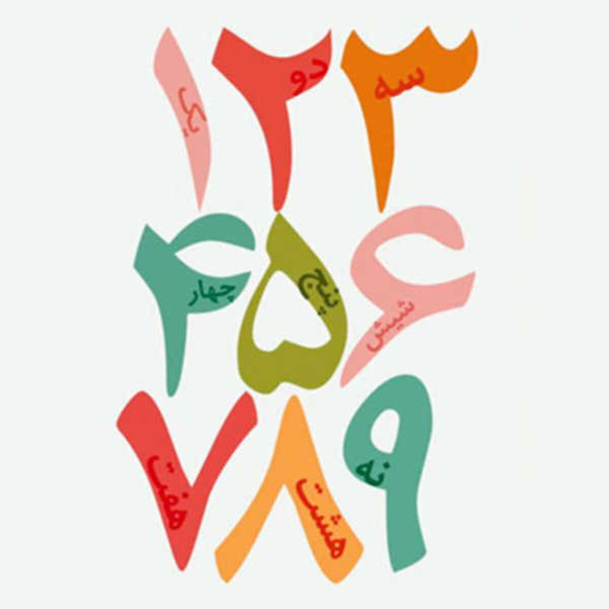

# PersianDigitsML

PersianDigitsML is a project focused on the prediction and classification of Persian handwritten numbers using a combination of machine learning and deep learning techniques. The primary goal of this project is to achieve high accuracy in recognizing Persian digits by exploring both traditional algorithms and advanced deep learning models.

## Dataset

The dataset used in this project is sourced from Kaggle and can be accessed [here](https://www.kaggle.com/datasets/amirmahdiabbootalebi/persian-handwritten-digits). It contains a variety of Persian handwritten digits for training and testing purposes.

## Features

- **Data Preprocessing:**  
  Techniques for preparing Persian handwritten digit datasets for training and testing to ensure optimal model performance.

- **Machine Learning Models:**  
  Implementation of traditional algorithms, including:
  - Support Vector Machines (SVM)
  - Random Forest
  - k-Nearest Neighbors (k-NN)  
  These models are utilized for effective digit classification.

- **Deep Learning Models:**  
  Utilization of advanced deep learning models, specifically Convolutional Neural Networks (CNN), to significantly enhance prediction accuracy.

- **Model Evaluation:**  
  Comprehensive comparison of various models based on key metrics such as accuracy, precision, and recall to determine the best-performing algorithms.

- **Real-time Prediction:**  
  Functionality to predict Persian digits using the trained models, demonstrating the practical application of the project.

